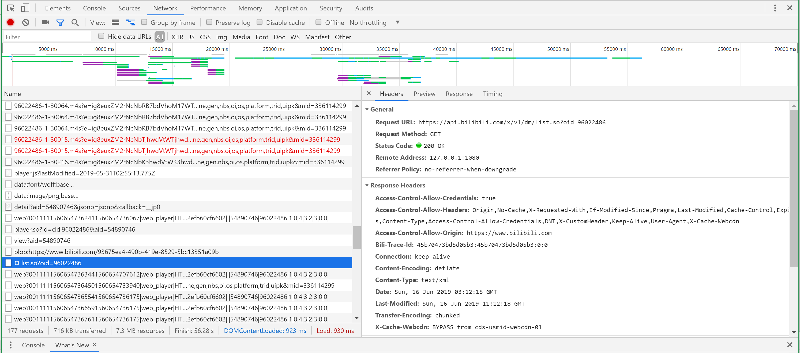

# 实验报告

这次python作业的完成经历可以说是相当曲折。

文首敬告：一开始爬些简单的小文本还是比较友好的，对新手而言B站的弹幕还是太勉强惹！！！

先说说思路？
- 作业的要求是1000+文本，所以灵光一现：诶？B站热门弹幕似乎是个不错的选择？

对，然后我的痛苦经历就这么开始了：

首先就是分析网页结构：
为了解决‘弹幕在哪’这个非常重要的问题，我毅然决然地摁下了F12

根据之前抓包的小小小经验呢，我在网页响应中寻找弹幕的痕迹

面对海量请求我依然毫无思路！！！对！！！一点没有！！！

但是呢，这个时候，频繁标红的这个小东西成功引起了我的注意：

抱着‘B站弹幕与服务器的交互很频繁’这一不成熟的想法，我试着用这串数字作为关键字过滤了一下

挨个双击（无比笨拙）以后发现了它

我辛辛苦苦寻找的弹幕列表（敲黑板）！！！

接下来就是寻找这串神秘数字和视频av号的关联

在网页元素面板浪费了不知道多少时间以后，我又回到了Network上寻找思路

根据它找见了：

https://api.bilibili.com/x/player.so?id=cid:96022486&aid=54890746

我们惊喜的发现：似乎这个东西里面av号和神秘数字都有哦~

而且找到神秘数字的关键字就是‘cid’,记！住！它!

然后就是代码部分惹：

十分感谢万能网友的帮助，让我在这个步骤没有那么费力：）

### 思路是这样的：
- 打开av链接
- 根据cid找到与弹幕关联的神秘数字，打开弹幕列表
- 根据tag找到每一条对应的弹幕
- 设置计数器，文本写入

【完结撒花~】

ps.通过此次经历，让我深感不好好学习的话以后很可能会去扫厕所。再次感谢万能网友的帮助，让我在ddl前一天顺利完成python作业